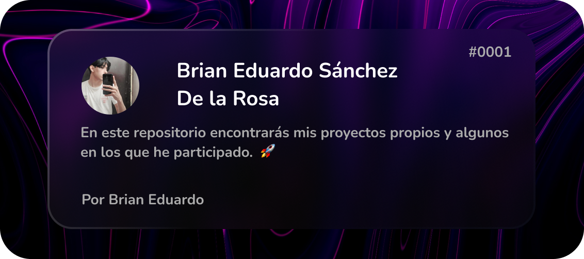

   <h2 align="center">¡Hey 👋! Soy Brian Eduardo 👨🏻‍💻</h2>

<h3 align="center">Soy un desarrollador Fron-end Jr y Diseñador UI en crecimiento. En busca de oportunidades para crecer, mejorar y colaborar en proyectos innovadores. 🚀</h3> 

